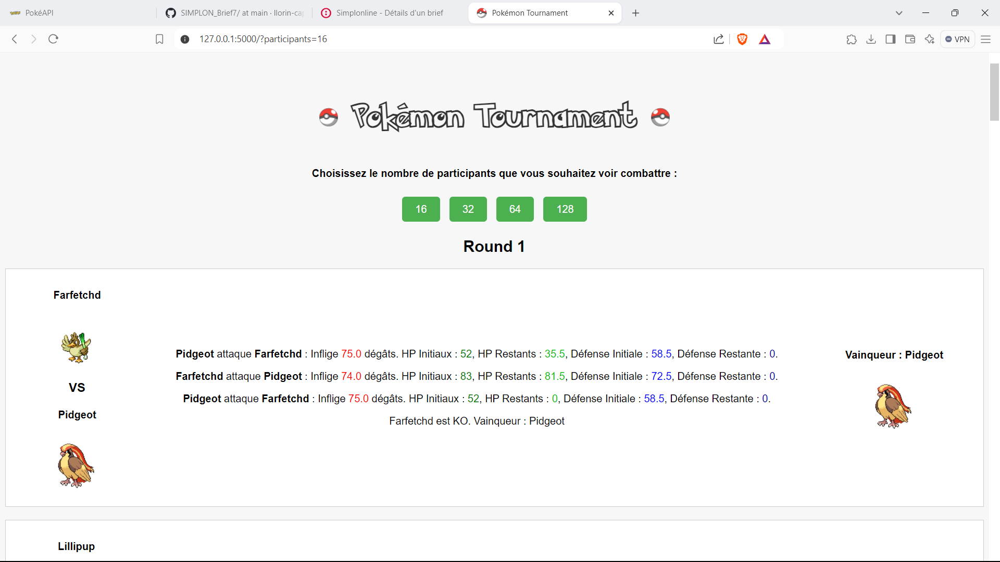

# Brief 7 - Utilisation d'une API

## Objectifs
L'objectif de ce projet est de simuler un tournoi Pokémon auquel participent 16 Pokémons aléatoires. Les données des Pokémons sont récupérées via l'API [PokéAPI](https://pokeapi.co/).

## Pré-requis
* PokéAPI v.2  
* Python 3.12.6 avec les librairies nécessaires (voir [requirements.txt](requirements.txt) )

## Guide d'utilisation
1. Télécharger les 4 éléments du repository, et les mettre dans un fichier
2. Dans le fichier créé, créer un fichier nommé "static" et un fichier nommé "templates"
3. Dans le ficher "static", glisser les éléments lea_front.css et lea_front.js
4. Dans le fichier "templates", glisser l'élément lea_front.html  
5. Ouvrir un terminal de commande (console Windows, PoowerShell...) et exécuter app.py via la commande
> python app.py
6. Cliquer sur le lien en résultat de la console : une fenêtre s'ouvre dans le navigateur, présentant les résultats du tournoi.

## Exemple de résultat

## Auteurs
* Léa Lorin @llorin-capi
* Yohan Matheus @codeboy1992
