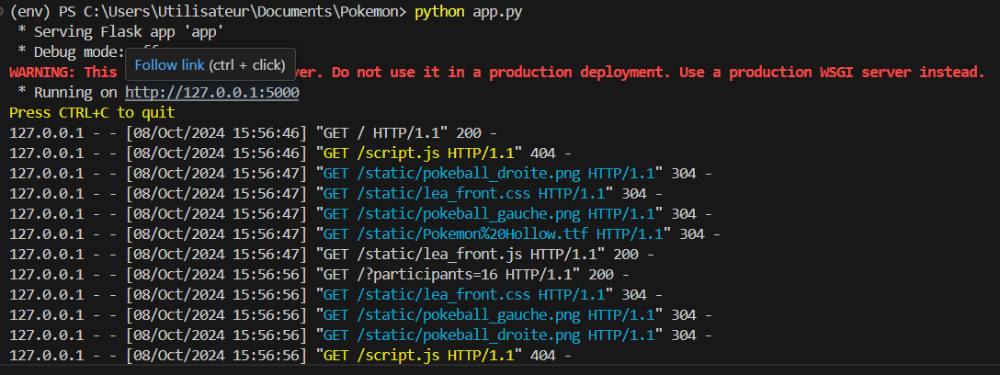

# Brief 7 - Utilisation d'une API

## Objectifs
L'objectif de ce projet est de simuler un tournoi Pokémon auquel participent 16 Pokémons aléatoires. Les données des Pokémons sont récupérées via l'API [PokéAPI](https://pokeapi.co/).

## Pré-requis
* PokéAPI v.2  
* Python 3.12.6 avec les librairies nécessaires (voir [requirements.txt](requirements.txt) )

## Guide d'utilisation
1. Télécharger les éléments du repository et les mettre dans un fichier
2. Ouvrir un terminal de commande (console Windows, PoowerShell...) et exécuter app.py via la commande
> python app.py
3. Cliquer sur le lien en résultat de la console : une fenêtre s'ouvre dans le navigateur, présentant les résultats du tournoi.

## Exemple de résultats obtenus
* Résultat de l'exécution de app.py :
  
* Résultat html obtenu

## Auteurs
* Léa Lorin @llorin-capi
* Yohan Mateus @codeboy1992
